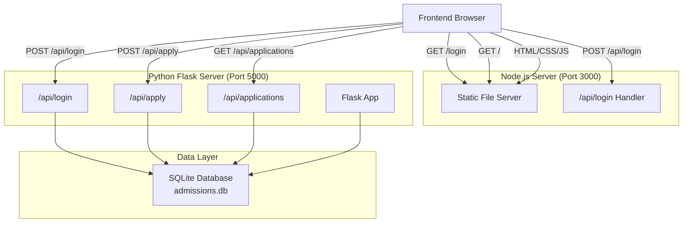
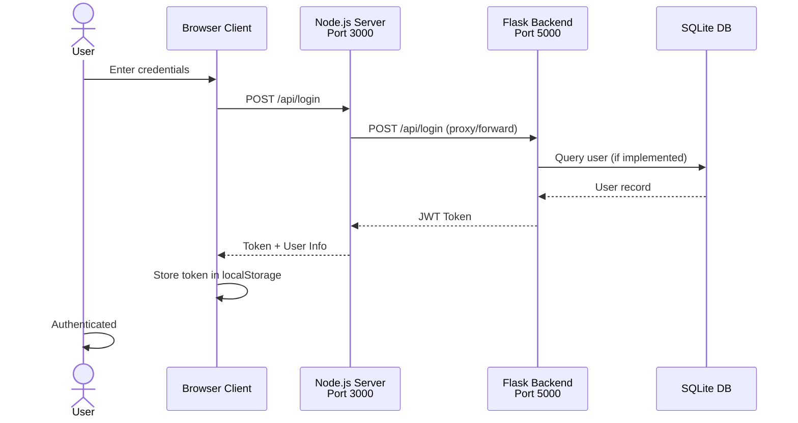
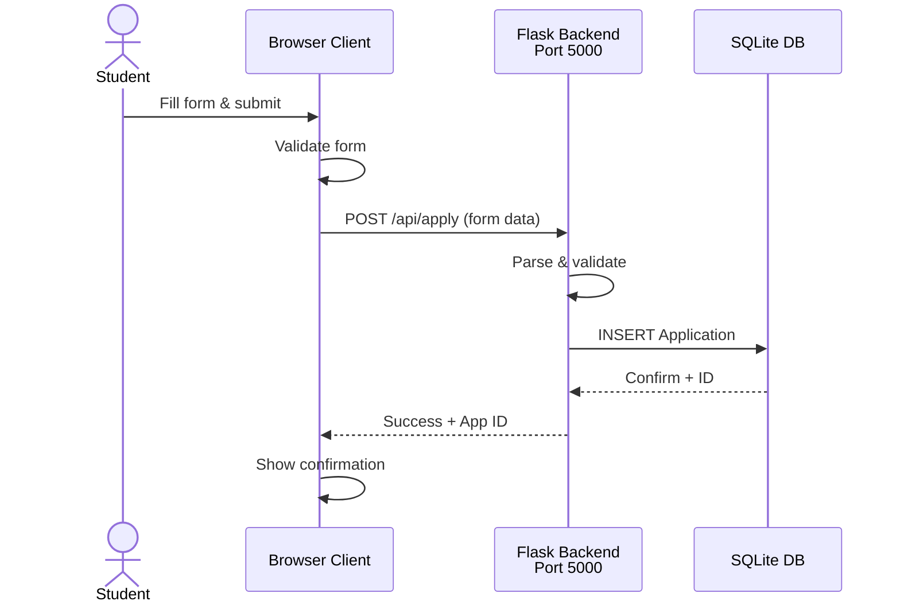
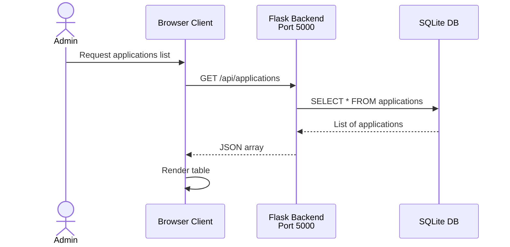

# System Architecture

## System Overview

The Cloud Admissions System is a full-stack application for managing student applications with authentication and form submission workflows.

### High-Level Architecture

## Component Interactions

### Request Flow: User Login

### Request Flow: Submit Application

### Request Flow: Retrieve Applications

## Technology Stack

| Layer | Technology | Version | Purpose |
|-------|-----------|---------|---------|
| Frontend | HTML/CSS/JavaScript | - | Form UI, authentication |
| Frontend Server | Node.js | v14+ | Static file serving on port 3000 |
| Backend | Python Flask | 2.x | REST API on port 5000 |
| Database | SQLite | 3.x | Persistent data storage (admissions.db) |
| ORM | SQLAlchemy | - | Database abstraction layer |

## Deployment Model

- **Frontend Server**: Node.js HTTP server (port 3000)
- **Backend API**: Flask development server (port 5000)
- **Database**: File-based SQLite (embedded with Flask)
- **Static Files**: Served from filesystem via Node.js

## Security Considerations

⚠️ **Current Limitations** (See ADR-002):
- Demo token generation without validation
- No real authentication implementation
- No CORS configuration
- Database file not encrypted
- No rate limiting or request throttling

See [ADR-002-Authentication-Strategy](../decisions/ADR-002-Authentication-Strategy.md) for planned improvements.

## API Gateway Pattern (Planned)

See [ADR-003-API-Gateway-Implementation](../decisions/ADR-003-API-Gateway-Implementation.md) for proposal to consolidate auth logic.
